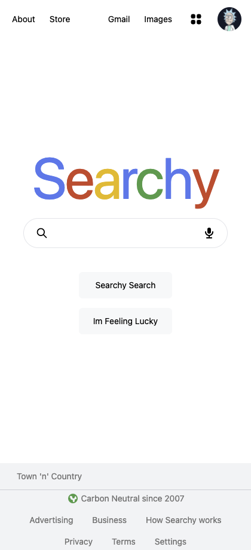

# Searchy
  

  # Live Site
  [Site](https://searchy.vercel.app/)
  
  # Table of Contents 
  * [Installation](#Installation) 
  * [Usage](#Usage) 
  * [License](#license)
  * [Contributing](#Contribute) 
  * [Testing](#Testing)
  * [Questions](#Questions)
  
  # Description 
A Google Clone ! Called Searchy :) I wanted to be able to create a search engine with googles custom search API although it is still in the first stages of development I do plan on adding more functionality to it and possibly upgrading the API but for now you can search random searches and get the correct searches back and it also grabs your current city in the bottom.

</img>
</img>
</img>
</img>
  
  # Installation
   **npm i**

  # Testing
  **npm test**

  # Contribute
  **Create pull request**

  # Usage
  **git clone**

  # Questions
  If you had any questions feel free to contact my email cuba289@gmail.com

  To see more of my work visit me here [Arecio3](https://github.com/Arecio3)

  # License
  

